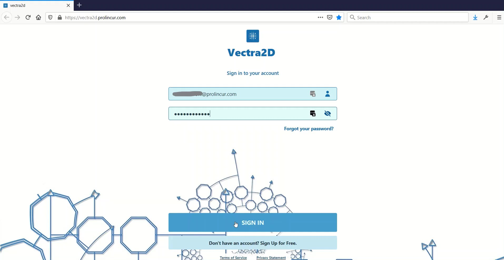

## Vectra2D™

Vectra2D™ is a fully automatic vectorization software. It is specifically designed for conversion of scanned images of
engineering drawing into 2D vector models. Vectra2D™ intelligently perform Skeletonization of lines and curves and 
automatically perform Optical Character Recognition (OCR) of text. The result is saved in SVG or DXF file format.

## Where to find Vectra2D™

- Webapp at [vectra2d.com](https://vectra2d.com)
- Google Play Store [Vectra2D](https://play.google.com/store/apps/details?id=com.prolincur.vectra2d)

## How to use Vectra2D™

1. Upload
Upload a scanned image of your drawing in PNG, JPG or TIFF format to Vectra2D™.

2. Convert & Compare
Convert the image into vector graphics. Compare the result with original image within the Vectra2D™.

3. Download
Download the output in SVG or DXF file format.

## Demo

## Pricing

Check out product pricing [here](https://www.prolincur.com/products/vectra2d/#pricing)

## Reporting issues

Report any enhancements, defects or raise any queries [here](https://github.com/prolincur/Vectra2DIssuebase/issues)
