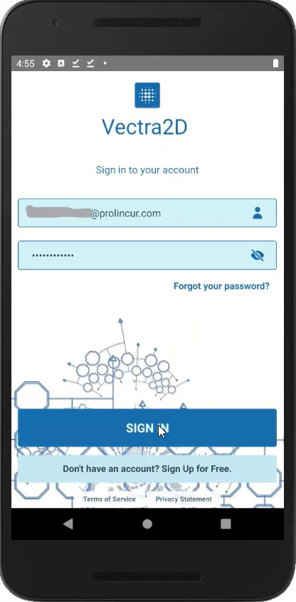

## Vectra2D

Vectra2D is a fully automatic vectorization software. It is specifically designed for conversion of scanned images of
engineering drawing into 2D vector models. Vectra2D intelligently perform Skeletonization of lines and curves and 
automatically perform Optical Character Recognition (OCR) of text. The result is saved in SVG or DXF file format.

## Where to find Vectra2D

- Webapp at [vectra2d.com](https://vectra2d.com)
- Google Play Store [Vectra2D](https://play.google.com/store/apps/details?id=com.prolincur.vectra2d)

## How to use Vectra2D

1. Choose Operation
Select any of 'Scan', 'SVG' or 'DXF'. 'Scan' for generating cleaned (black and white) image, 'SVG' for generating vector graphics in SVG file format and similar 'DXF' for generating vector graphnics in DXF file format.

2. Upload File
Upload a scanned image of your technical drawing in PNG, JPG or PDF format or take picture of the drawing using camera of your device.

3. Convert & Compare
Convert the original image to vector graphics. Compare the result with original image within the Vectra2D.

4. Download
Download the output in PNG, SVG or DXF file.

## Demo

## Pricing

- Trial features can be accessed as 'Guest' user on Android App.
- Sign-in to have advertisement-free experience of the free features of the app.
- No additional sign-up required for Onshape and Autodesk Forge users.
- Buy paid featuring using In-App purchase on Android App. Bought features will also on web-app. 
- Check out details of paid features and product pricing [here](https://www.prolincur.com/products/vectra2d/#pricing)

## Reporting issues

Report any enhancements, defects or raise any queries [here](https://github.com/prolincur/Vectra2D/issues)
